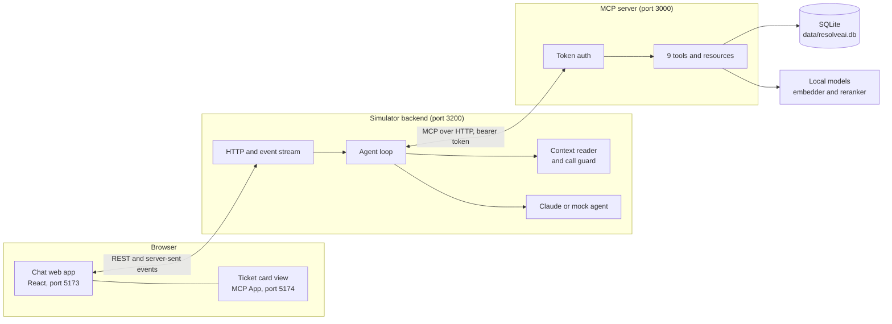
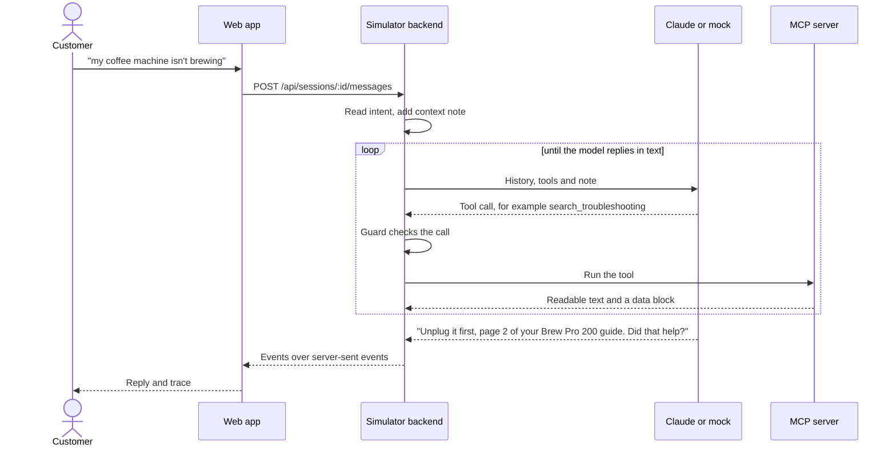
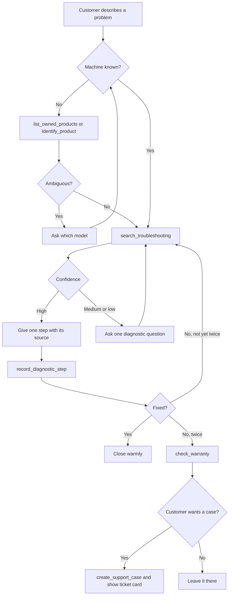
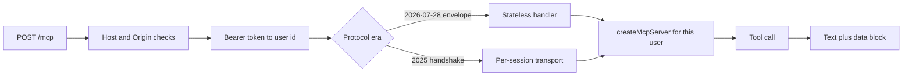
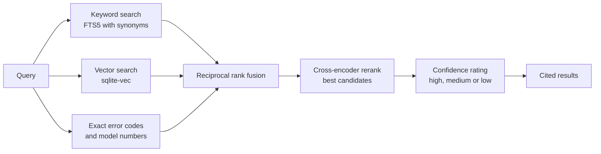

# ResolveAI

An Alexa+-style troubleshooting agent for home products. A customer describes a problem ("my coffee machine isn't brewing"), and the agent finds their machine, searches the manuals, gives one step at a time, checks the warranty and, if nothing works, files a support ticket.

It is built on a self-hosted **MCP server** (Streamable HTTP) with **agentic RAG**: the model decides which tools to call, and every answer is grounded in the product documentation with a page citation. Built for the Amazon Developer Hackathon.

The repo has two parts:

- **MCP server** (`packages/server`): the tools, the documentation search index and the support case store.
- **Simulator** (`packages/simulator`): a chat web app and agent loop that talk to the MCP server, so you can try the agent end to end.

## Tech stack

| Area | Technology |
| --- | --- |
| Language and runtime | TypeScript, Node.js 20+, npm workspaces |
| Agent protocol | Model Context Protocol (MCP) over Streamable HTTP, MCP Apps for the ticket card view |
| LLM | Claude (Anthropic SDK), with an offline mock agent for demos without a key |
| Search | SQLite with `sqlite-vec` (vectors) and FTS5 (keywords), fused by reciprocal rank |
| Embeddings and reranking | `transformers.js`: `all-MiniLM-L6-v2` embeddings, `ms-marco-MiniLM-L-6-v2` cross-encoder |
| Web app | React 19, Vite |
| Validation | Zod |
| Testing | Vitest, Testing Library, retrieval and multi-turn scenario evals |

## Architecture

Four processes run locally. The browser never talks to the MCP server directly: the simulator backend runs the agent loop and calls MCP tools on the customer's behalf, using that customer's token.



| Piece | Job |
| --- | --- |
| Chat web app | Shows the conversation and a trace of every tool call |
| Agent loop | Sends the history to the model, runs the tools it asks for, repeats until it replies |
| Context reader and guard | Works out what the customer's line means, adds a short note for the model, and blocks pointless or repeated tool calls |
| MCP server | Owns the data: products, documents, cases and warranty |
| SQLite | Products, document chunks, keyword and vector indexes, support cases |

## Application flow

One customer message, from the browser to a reply:



How the agent works through a problem:



Safety words (smoke, sparks, shock, water near a plugged-in machine) skip all of this: the agent tells the customer to unplug it if safe and contact support.

## MCP server flow

The server exposes one endpoint, `/mcp`. Every request is authenticated, and the user behind the token is fixed when the server instance is created, so a tool can only see that user's machines and cases.



| Tool | What it does |
| --- | --- |
| `list_owned_products` | The machines registered to the customer |
| `identify_product` | Matches the customer's words to a catalog model, flags ambiguity |
| `get_product` | Specs, known issues and documents for a model |
| `search_troubleshooting` | Searches manuals, guides and warranty terms, returns cited passages and a confidence |
| `get_document_section` | Reads a whole page around a search result |
| `get_case_state` | What has been asked and tried so far |
| `record_diagnostic_step` | Saves a question, answer, step or outcome to the case |
| `check_warranty` | Whether the machine is covered, and until when |
| `create_support_case` | Files a ticket and returns a ticket card view |

How `search_troubleshooting` finds and rates an answer:



Confidence tells the agent whether to answer from the results or ask a question instead. Measured search quality is in `packages/server/eval/README.md`.

## Local setup

You need Node.js 20 or newer and about 150 MB of disk for the models, which download on first use.

**1. Install**

```bash
npm install
```

**2. Build the search index** from the sample documents in `corpus/`

```bash
npm run ingest                       # real embeddings, downloads the model on first run
npm run ingest -- --embedder hash    # offline and non-semantic, for quick checks
```

**3. Start everything**

```bash
npm run demo:mock    # offline mock agent, no API key needed
npm run demo         # uses Claude if ANTHROPIC_API_KEY is set, otherwise the mock
```

To use Claude, export a key first: `export ANTHROPIC_API_KEY=sk-ant-...`

**4. Open** http://localhost:5173 and pick the demo user Alex, who owns one Brew Pro 200. Try "my coffee machine isn't brewing, only drops come out".

| Port | Service |
| --- | --- |
| 5173 | Chat web app |
| 5174 | Sandbox for MCP App views |
| 3200 | Simulator backend |
| 3000 | MCP server (`/mcp`) |

### Run the MCP server alone

```bash
MCP_USER_TOKENS=token-alex:demo-alex npm run dev:server   # http://127.0.0.1:3000/mcp
```

Each `MCP_USER_TOKENS` entry is `token:user-id`, a demo user's linked account. `MCP_BEARER_TOKEN` adds a token with no user behind it. Run `npm run ingest` first.

### Settings

| Variable | Effect |
| --- | --- |
| `ANTHROPIC_API_KEY` | Lets the demo use Claude instead of the mock agent |
| `RESOLVEAI_RERANKER=off` | Skips the cross-encoder (about 90 MB, 150 to 200 ms per search) and uses the original ranking |
| `RESOLVEAI_EMBEDDER=hash` | Fully offline mode, ingest with `--embedder hash` too |
| `RESOLVEAI_AGENT_MODEL` | Claude model for the agent, default `claude-sonnet-5-5` |
| `RESOLVEAI_DB` | Path to the SQLite index, default `data/resolveai.db` |

### Tests and evals

```bash
npm test                                          # all unit and integration tests
npm run test:model -w @resolveai/server           # calibration check against the real embedding model
npm run eval:retrieval -w @resolveai/server       # 85-query retrieval eval, dev and held-out metrics
npm run eval:multiturn -w @resolveai/simulator    # multi-turn scenario eval of the agent
```

## Sample data

`corpus/` holds synthetic Brewwell coffee machine manuals, troubleshooting guides and warranty terms for four models (Brew Pro 200, Brew Pro 300, DripMate 12, Espresso Studio ES-1), plus `demo.json` with one demo user, Alex, who owns one machine.
